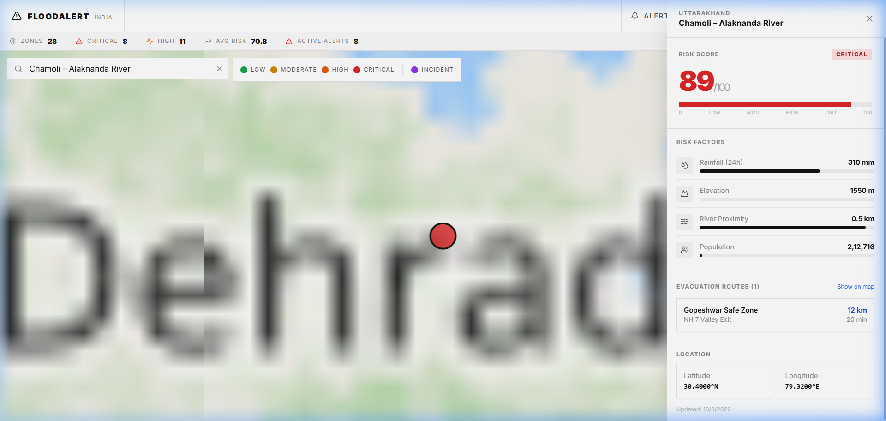
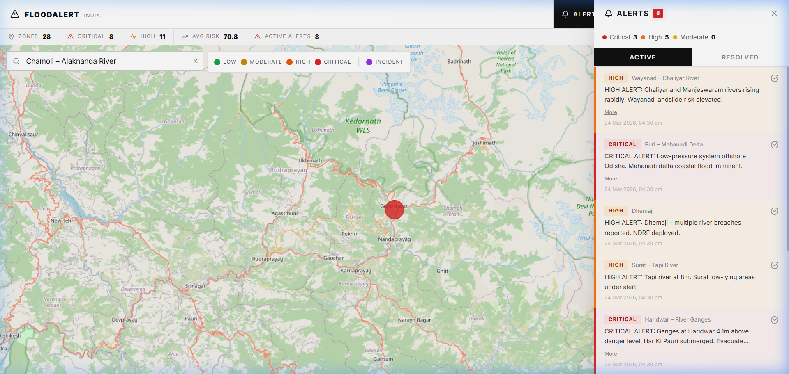
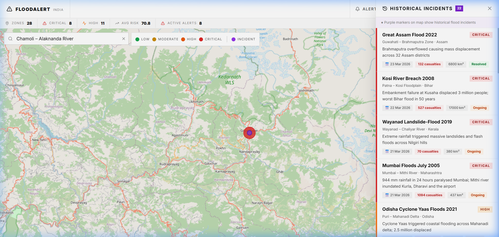
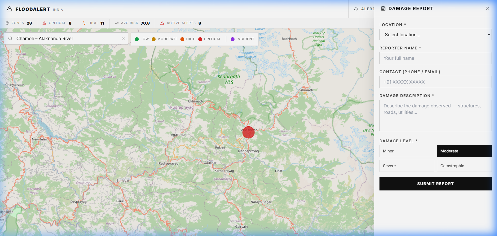

# FloodAlert India 🌊

Hey everyone, welcome to the repo for FloodAlert India. This is a real-time flood monitoring and early warning system I built to help track and manage flood risks across different states and river basins in India. 

The goal here was to build something genuinely useful—a dashboard that aggregates live data, historical context, and user-submitted reports into one unified map interface. 

Here’s a breakdown of how the web app actually works, along with screenshots of the different features!

## How It Works: Feature Walkthrough

### 1. The Main Dashboard & Map View
When you first load up the app, you get a bird's-eye view of the country with all the active monitor zones. The map uses color-coded markers (from green for low risk, all the way to red for critical) so you can instantly see where the problem areas are without having to dig through tables.

*The main overview — tracking 28 total zones with 8 critical hotspots currently active.*

---

### 2. Location Deep Dive (Search & Risk Analysis)
If you want to know what's happening at a specific location, you can just use the search bar. Clicking on a location (like the Alaknanda River in Chamoli) slides open a detailed panel. Here, the app calculates a dynamic Risk Score out of 100 based on rainfall, river proximity, and elevation. It also shows you the nearest safe evacuation routes and estimated travel times.

*Checking the real-time telemetry and evacuation routes for a specific high-risk zone.*

---

### 3. Real-Time Active Alerts
We have an "Alerts" center built into the top nav. When you open this, you get a clean feed of all currently active warnings, sorted by severity. These alerts provide detailed context on why a zone is critical (e.g., river breaches, embankment pressure) so local authorities or residents know exactly what they are dealing with.

*The Active Alerts sidebar showing critical pressure points in Patna, Wayanad, and Puri.*

---

### 4. Historical Incidents Context
One of the coolest features is the integration of historical data. The purple markers on the map represent major past flood events (like the 2005 Mumbai Floods or the 2008 Kosi Breach). Clicking these markers opens up a historical timeline, letting researchers or planners see the impact (casualties, area affected) of previous disasters in that exact geographical area to better prepare for the future.

*Reviewing the devastating scale of past incidents directly on the interactive map.*

---

### 5. Crowdsourced Damage Reporting
Data from sensors isn't always enough, so I added a public "Report Damage" feature. Anyone on the ground can open this form, select their location, and submit a detailed report on local infrastructure damage (roads, buildings, utilities). This crowdsourced data is immediately flagged for review.

*The public submission form for reporting minor to catastrophic local damage.*

---

### 6. The Authority Admin Dashboard
Finally, to actually manage all of this, there is a secured Admin Dashboard. When an authorized user clicks "Admin" and enters their credentials, they get access to the backend control center. From here, they can view every single incoming alert in a tabular format, resolve alerts once a situation is handled, and officially log new incidents into the historical database. 

*The protected admin control panel for resolving alerts and managing incident records.*

---

### Tech Stack & Setup
If you want to spin this up locally:
- **Frontend**: React (Vite) + Tailwind CSS + React-Leaflet for mapping.
- **Backend**: Python Flask REST API + SQLite.
- **Security**: The admin routes are protected by Werkzeug password hashing. (The admin password `flood@0001` is stored securely as a cryptographic hash on the backend, ensuring zero plaintext leakage).

To run it locally:
1. `cd server`
2. `pip install -r requirements.txt` (or install flask, flask-cors, werkzeug)
3. `python app.py`
4. The frontend is pre-built in `client/dist` and is statically served by the Flask app on `http://localhost:5000`.

Feel free to fork and contribute!
