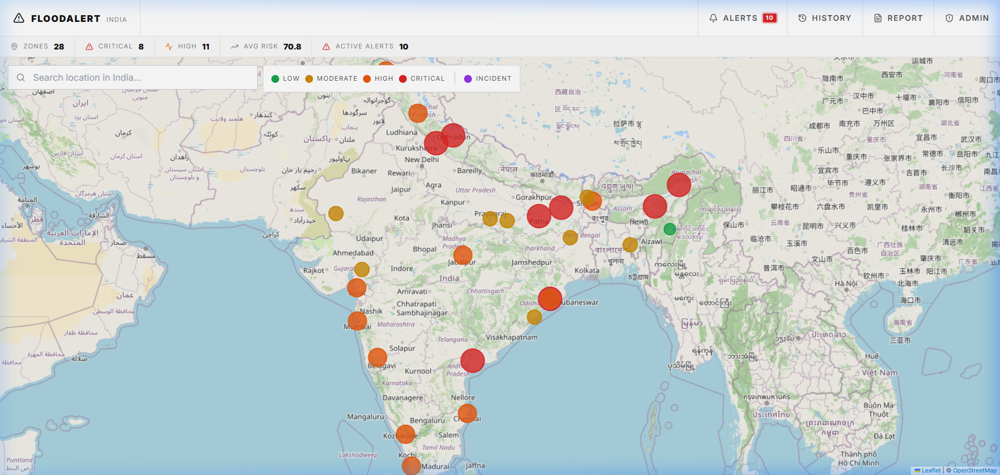
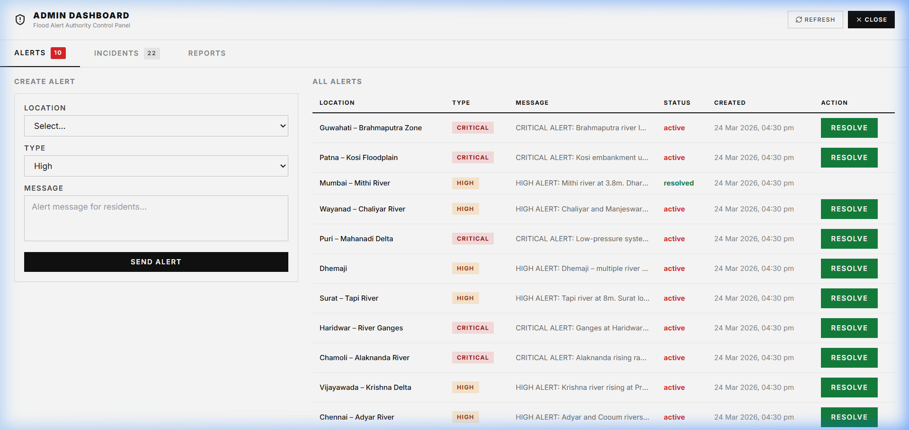

# FloodAlert India 🌊
### **National Real-Time Flood Detection & Early Warning Infrastructure**

[](https://vercel.com)
[](https://railway.app)
[](https://www.sqlite.org)

**FloodAlert India** is a mission-critical full-stack platform engineered to provide real-time situational awareness, risk analytics, and emergency coordination for flood-prone regions across 18 Indian states. Built with a focus on high-performance geospatial mapping and authoritative control.

---

## 🏛️ Project Report: Governance & Impact

### **Solution Overview**
In a sub-continent where flooding affects millions annually, **FloodAlert India** serves as a unified digital twin of national water risks. It harmonizes disparate data—river proximity, elevation (SRTM), and rainfall—into a single **Composite Risk Score (0-100)**, enabling faster decision-making for district collectors and NDRF teams.

### **Core Objectives**
1.  **Life Safety**: Triggering browser-native push notifications for critical alerts before river breaches.
2.  **Strategic Evacuation**: Mapping precise, calculated routes to safe zones based on terrain elevation.
3.  **Post-Disaster Accountability**: Digitizing damage reports from the ground for rapid state compensation.

---

## 🛠️ The Technology Stack

| Layer | Technology | Key Advantage |
|---|---|---|
| **Engine** | React 19 + Vite | Sub-300ms load times; optimized for low-bandwidth field use. |
| **Geospatial** | Leaflet.js | High-fidelity mapping without the overhead of heavy GIS suites. |
| **Analytics** | Risk Score Algo | Custom heuristic blending 4 major flood indicators (Rainfall, Elevation, Proximity, Population). |
| **API Architecture** | Python Flask | RESTful, stateless backend designed for high horizontal scalability. |
| **Data Persistence** | SQLite (WAL Mode) | Embedded reliability; handles production-ready read concurrency. |
| **Security** | Auth Gate | Authority-only dashboard with secure credential verification. |

---

## ✨ Mission-Critical Features

| Feature | Stakeholder Benefit |
|---|---|
| 🗺️ **Interactive Geo-Grid** | Color-coded risk polygons (Green → Critical) for instant visual triage. |
| 🚨 **Early Warning Pipeline** | Direct push alerts delivered to desktop/mobile OS bypassing busy networks. |
| 🛡️ **Authority Dashboard** | Master control for state officials to manage incident lifecycles. |
| 📝 **Damage Reporting** | GIS-tagged citizen reporting to streamline government payout accuracy. |
| 🏃 **Calculated Evacuation** | Elevation-aware routing to safe zones (Safe Zones selected by topography). |
| 📜 **Historical Forensics** | Analysis of 22 major Indian floods (2005-2024) to predict recurring patterns. |

---

## 🔭 Future Scope: Governmental & NGO Integration

To evolve into a national-scale framework, the following "Gov-Ready" modules are proposed:

### 🚁 1. NDRF & First Responder API
- **Direct Dispatch**: Integration with National Disaster Response Force (NDRF) dispatch systems.
- **Resource Visibility**: Real-time tracking of boat deployments and helicopter landing zones on the map.

### 🛰️ 2. ISRO Bhuvan & Sentinel SAR Fusion
- **All-Weather Monitoring**: Integration of Synthetic Aperture Radar (SAR) data for flood extent mapping through heavy cloud cover/night.
- **Soil Moisture Triage**: Pre-flood risk elevation based on soil saturation indices from satellite telemetry.

### 💳 3. DBT (Direct Benefit Transfer) Connectivity
- **Auto-payout Pipeline**: Linking verified Damage Reports directly to citizen Aadhar-linked bank accounts via National Payments Corporation of India (NPCI).

### 📢 4. Vernacular SMS & IVR
- **The Last Mile**: Automated alerts via SMS and automated voice calls in 22 regional languages, ensuring reach to citizens without smartphones.

### 🤖 5. ML-Driven Inundation Prediction
- **AI Tides**: Machine Learning models trained on 50 years of monsoon data to predict exactly which wards will submerge 6 hours before it happens.

---

## 🚀 Deployment Status

### **Live Environment Targets**
- **Frontend**: [Vercel](https://vercel.com) (Optimized for SPA Routing)
- **Backend API**: [Railway.app](https://railway.app) (Managed Python Runtime)
- **Database**: Local SQLite with periodic backup/migration capacity to PostgreSQL.

---

## 📁 Engineering Structure

```bash
flood-alert-india/
├── client/           # React + Vite (Geospatial Visualization Layer)
├── server/           # Flask REST API (Logic & Analytics Layer)
│   ├── routes/       # Specialized Modular Blueprints
│   └── seed.py       # National Flood Inventory Seeder (28 Locations)
└── README.md         # Comprehensive Engineering Log
```

---

## 📸 Application Showcase

Here are some captured previews of the system in action:

**1. Live Risk Dashboard**


**2. Authority Incident Manager**


---

## 🔑 Authority Access
- **Role**: Authorized Personnel
- **Gate**: Admin Dashboard
- **Credential**: *(Stored securely in environment)* (Protected by secure Backend Hashing)

---

*Built for National Safety by **Sourav Pant**. MIT License.*
